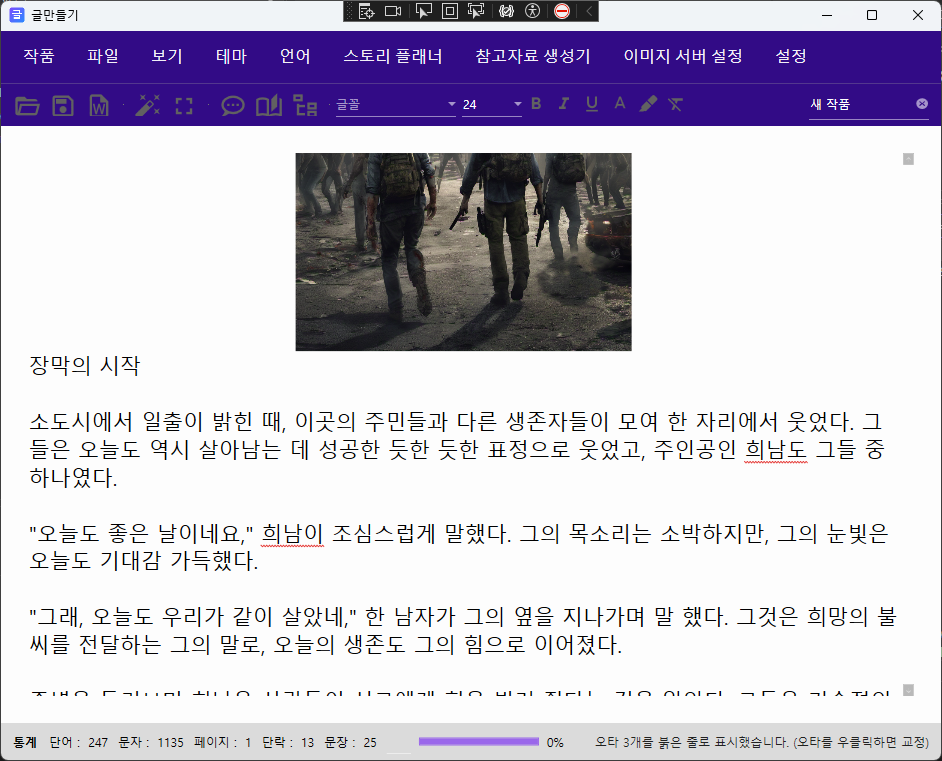
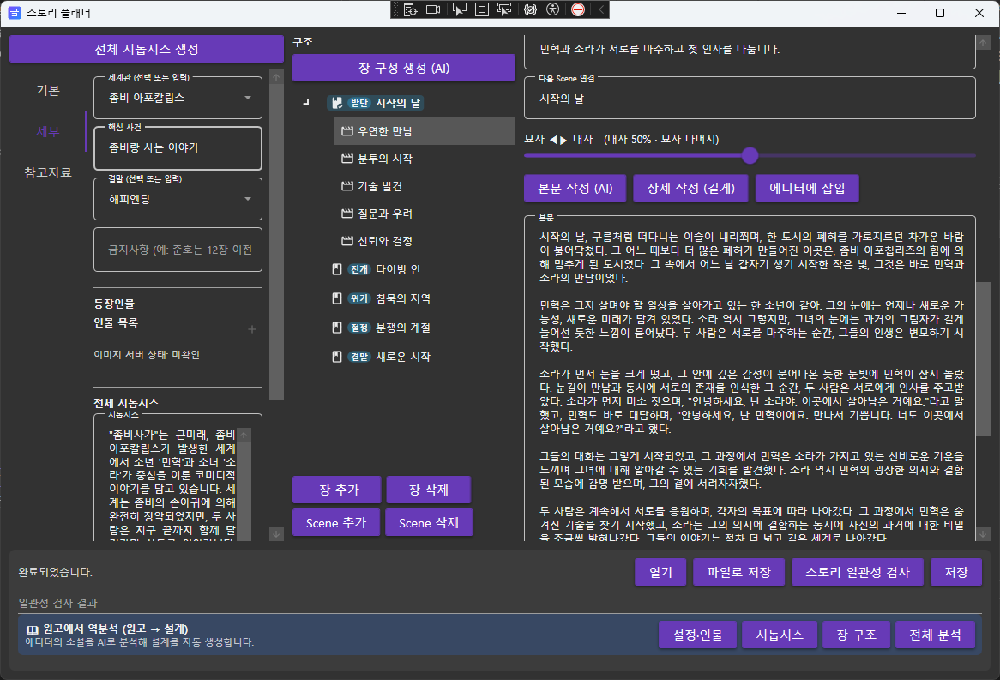
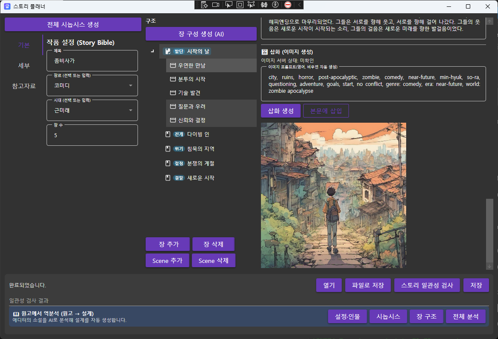
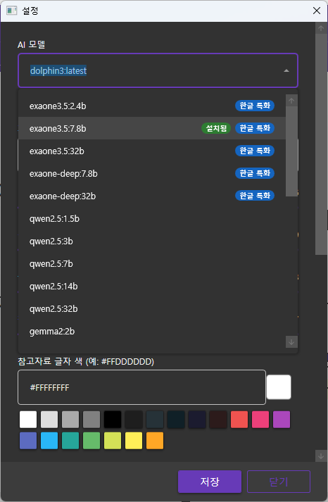
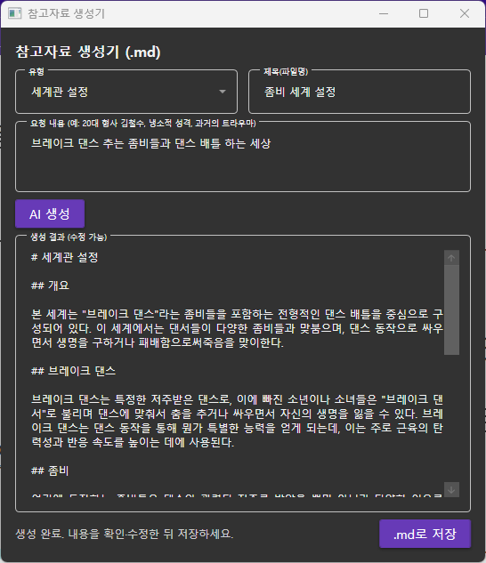
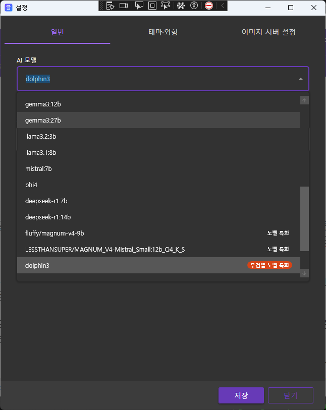
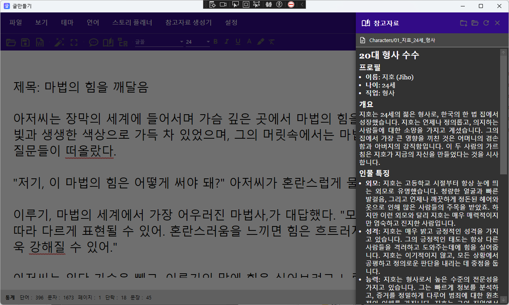
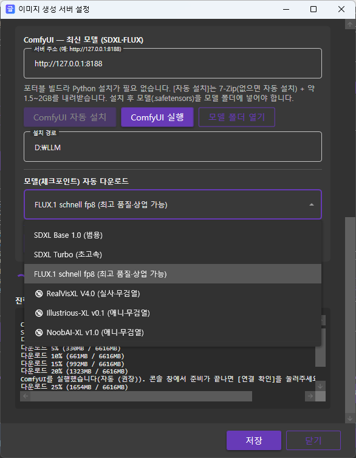
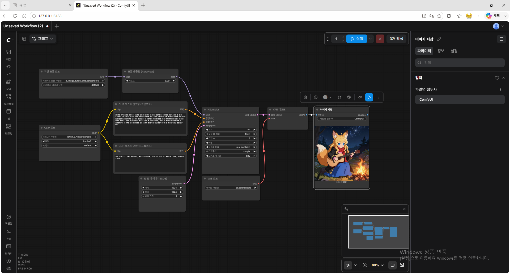

# Novel Writer

## 프로젝트 개요
AI 글 작성해주는 데스크톱 애플리케이션

  
   
  

 
   
  
 

 
  
 
   
  

  
 
   
  

## 기술 요구사항
- **프레임워크**: WPF (Windows Presentation Foundation), .NET 6 이상
- **아키텍처 패턴**: MVVM (Model-View-ViewModel)
- **라이브러리**: 
  - Microsoft.Toolkit.Mvvm (MVVM 패턴)
  - DocumentFormat.OpenXml (DOCX 처리)
  - System.Data.SQLite (로컬 데이터베이스)
- **언어**: C#
- **플랫폼**: Windows 데스크톱

## 시스템 요구사항 (설치 · 실행)

### 기본 (AI 없이 사용)
맞춤법 검사(Hunspell)·집중 모드·통계·DOCX 저장 등 **기본 기능은 오프라인**으로 동작합니다.

| 항목 | 최소 | 권장 |
|------|------|------|
| OS | Windows 10 (64-bit) | Windows 11 (64-bit) |
| 런타임 | .NET 8 데스크톱 런타임 | 최신 .NET 8 |
| RAM | 8GB | 16GB |
| 저장공간 | 500MB (앱 + 사전) | 1GB 이상 |

### AI 기능 사용 시 — Ollama + 로컬 LLM (선택)
AI 채팅·문맥 검사·스토리 플래너·참고자료 생성은 **로컬 LLM**을 사용합니다. [Ollama](https://ollama.com/download)를 설치하고 모델을 받아야 합니다.

1. **Ollama 설치**: <https://ollama.com/download> (Windows용 설치)
2. 앱의 **설정 → AI 모델**에서 모델을 고르고 저장하면 자동으로 다운로드 안내가 뜹니다. (또는 터미널에서 `ollama pull <모델명>`)
3. Ollama가 실행 중이어야 AI 기능이 동작합니다.

> **메모리 규칙**: 로컬 LLM은 모델 전체가 **RAM(CPU 추론) 또는 VRAM(GPU 가속)** 에 올라가야 합니다. GPU가 없으면 RAM으로 CPU 추론이 가능하지만 속도가 느립니다. 아래 값은 4bit 양자화 기준이며, 실사용 시 컨텍스트 버퍼로 2~4GB 여유가 더 필요합니다.

### LLM 모델별 최소 사양

| 모델 (Ollama 태그) | 다운로드 | 최소 RAM (CPU 추론) | 권장 VRAM (GPU) | 특징 |
|--------------------|---------|--------------------|-----------------|------|
| `exaone3.5:2.4b` | ~1.6GB | 8GB | 4GB | 한글 특화 · 가장 가벼움 |
| `exaone3.5:7.8b` | ~4.8GB | 16GB | 8GB | 한글 특화 · **권장 기본** |
| `exaone3.5:32b` | ~19GB | 32GB+ | 24GB (RTX 4090급) | 한글 특화 · 최고 품질 |
| `qwen2.5:7b` | ~4.7GB | 16GB | 8GB | 다국어 · 상업 허용 |
| `qwen2.5:14b` | ~9GB | 24GB | 12GB | 다국어 · 고품질 |
| `gemma2:9b` | ~5.4GB | 16GB | 8GB | 범용 |
| `llama3.1:8b` | ~4.9GB | 16GB | 8GB | 범용 |
| `fluffy/magnum-v4-9b` | ~5.5GB | 16GB | 8GB | **노벨(창작) 특화** |
| `dolphin3` (8B) | ~4.9GB | 16GB | 8GB | 무검열 창작 |
| `mannix/llama3.1-8b-abliterated` | ~4.9GB | 16GB | 8GB | 무검열 창작 |

- **가벼운 PC / 노트북(내장 그래픽)**: `exaone3.5:2.4b` 권장 (오타·간단 생성엔 충분).
- **일반 데스크톱(RAM 16GB, VRAM 8GB)**: `exaone3.5:7.8b` 또는 `magnum-v4-9b` 권장.
- **고사양(VRAM 24GB+)**: `exaone3.5:32b`, `qwen2.5:14b`로 품질 극대화.
- EXAONE 3.5는 **비상업(연구·개인용)** 라이선스입니다. 상업 배포 시에는 Qwen2.5·Gemma 등 상업 허용 모델을 사용하세요.

## 최소 기능 요구사항
1. 집중 모드: 전체화면, 메뉴/UI 자동 숨김 (마우스 이동시 표시)
2. 텍스트 에디팅: 기본 입력/삭제, 실시간 통계
3. 통계: 단어수, 문자수, 페이지수, 단락수, 문장수
4. 저장: SQLite 기반 로컬 저장, 자동 저장, 백업
5. 내보내기: DOCX 형식 저장
6. 테마: 다크모드, 라이트모드, 커스텀 테마
7. 다국어: 한글, 영어 지원
8. 타이머: 목표 시간 설정 및 카운트다운
9. 일일 목표: 단어수 목표 설정 및 진행률 표시
10. 한글 단어 오류 검사.
11. ai로 문서 작성 오타 수정. 

## 코드 스타일 요구사항
- MVVM Toolkit의 ObservableObject, RelayCommand 사용
- partial 클래스 + [ObservableProperty] 속성 사용
- 비동기 작업은 async/await 사용
- XML 문서 주석 추가 (요약, 파라미터, 반환값)
- 한글 주석 사용
- 인덴트: 4칸 (탭 사용 금지)

## 코드 스타일 요구사항
- MVVM Toolkit의 ObservableObject, RelayCommand 사용
- partial 클래스 + [ObservableProperty] 속성 사용
- 비동기 작업은 async/await 사용
- XML 문서 주석 추가 (요약, 파라미터, 반환값)
- 한글 주석 사용
- 인덴트: 4칸 (탭 사용 금지)

